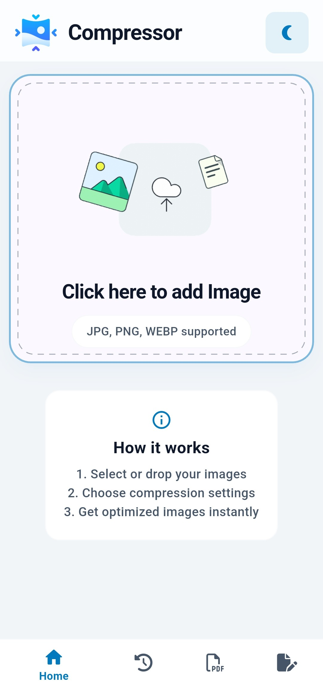
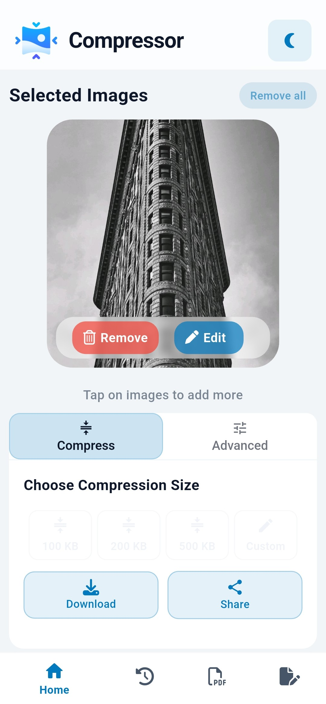
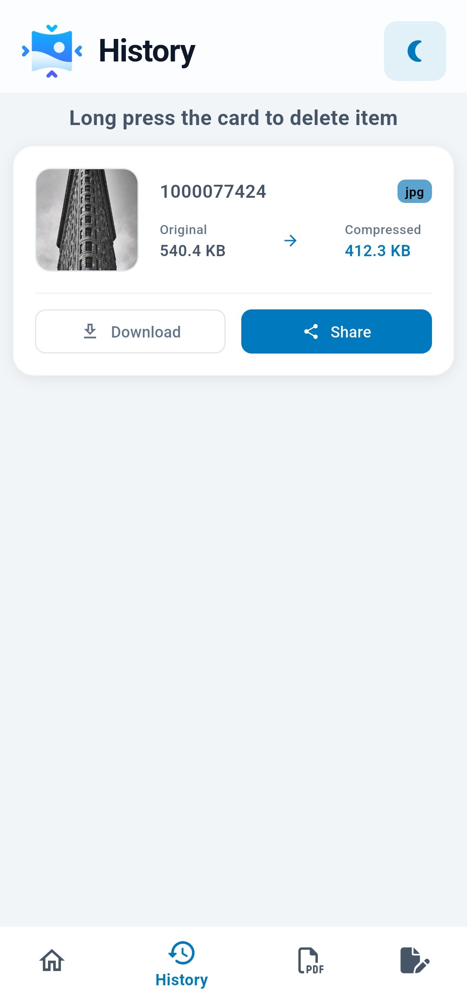
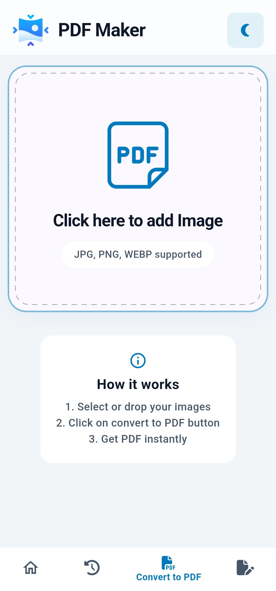
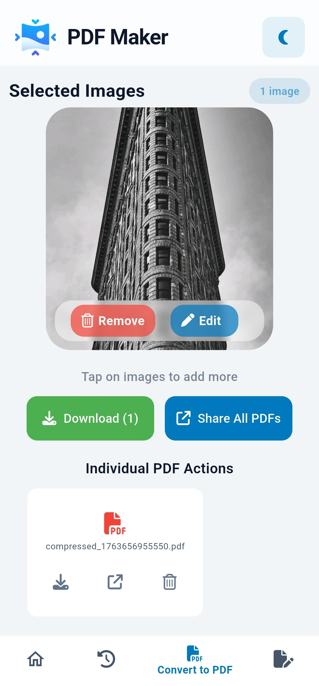
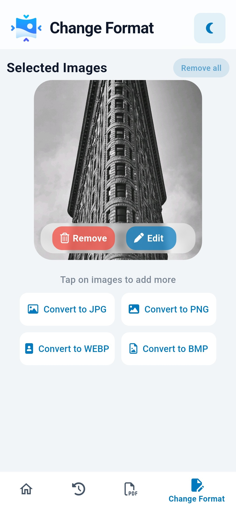

# 📱 Image Compressor


A powerful yet simple **Flutter app** that helps users compress, convert, and resize images for various official purposes like exam forms, government documents, or passport photos — built with 💙 Flutter and 🔧 GetX for fast and responsive performance.

> Designed with **simplicity and accessibility** in mind.

---

## ✨ Features

### 📸 Quick Compress
- **One-tap compression** with preset size options (50KB, 100KB, 200KB)
- **Custom size input** for specific requirements
- Real-time preview with before/after file size comparison
- Swipeable card carousel for multi-image selection

### 🛠️ Advanced Compression
- Fine-tune **quality** (1-100%)
- Adjust **resolution** (width × height)
- Select output **format** (JPG, PNG, WEBP)
- Custom target **file size** with automatic optimization

### 🔄 Format Conversion
- Convert images between **JPG**, **PNG**, **WEBP**, and more
- Batch convert multiple images at once
- Visual format preview with file type indicators
- Maintains image quality during conversion

### 📄 Image to PDF
- Convert **multiple images** to a single PDF document
- Arrange image order before conversion
- High-quality PDF output
- Direct save to gallery or share

### 📂 History & Management
- View all **previously compressed** images
- **Download** processed images to gallery
- **Share** directly to other apps
- Delete individual entries or clear all

### 🎨 Theme Support
- **Dark Mode** and **Light Mode** support
- Smooth theme transitions
- Persistent theme preference

### 📱 Android Home Widget
- **Quick Compress** shortcut
- **PDF Conversion** shortcut
- **Format Change** shortcut
- **History** access
- Stylish glassmorphism design

### 💾 Save & Share
- Save compressed images directly to **device gallery**
- Share via any installed app (WhatsApp, Email, etc.)
- Batch download and share options

---

## 📱 Screenshots

| | | |
|:---:|:---:|:---:|
|  |  |  |
|  |  |  |

---

## 🎯 Why This App?

Most students and users waste time figuring out the correct dimensions, quality, or formats while uploading images for exams or forms. This app automates that — **just pick your use case and go**.

💡 Inspired by real-life frustrations during online form filling, especially by those who are not tech-savvy.

---

## 🛠️ Tech Stack

| Category | Technology |
|----------|------------|
| **Framework** | Flutter |
| **State Management** | GetX |
| **Image Compression** | flutter_image_compress |
| **Image Picker** | image_picker, photo_manager |
| **PDF Generation** | pdf |
| **Local Storage** | sqflite, get_storage |
| **Gallery Saver** | image_gallery_saver_plus |
| **Sharing** | share_plus |
| **Permissions** | permission_handler |
| **Monetization** | google_mobile_ads |
| **Home Widget** | home_widget |
| **UI Components** | flutter_card_swiper, dotted_border, font_awesome_flutter |

---

## 🚀 Getting Started

### Prerequisites
- Flutter SDK ^3.8.1
- Android Studio / VS Code
- Android device or emulator

### Installation

```bash
# Clone the repository
git clone https://github.com/padhiarmeet/Image-Compressor.git

# Navigate to project directory
cd Image-Compressor

# Install dependencies
flutter pub get

# Run the app
flutter run
```

### Build APK

```bash
flutter build apk --release
```

---

## 📁 Project Structure

```
lib/
├── main.dart                 # App entry point
├── controllers/              # GetX controllers
│   ├── compressImageController.dart
│   ├── database_controller.dart
│   ├── format_change_view_controller.dart
│   ├── pdf_view_controller.dart
│   ├── themeController.dart
│   └── reward_controller.dart
├── frontend/                 # UI screens
│   ├── homePage.dart         # Main compression screen
│   ├── formate_change_screen.dart
│   ├── pdf_screen.dart
│   ├── history_screen.dart
│   └── layout_page_screen.dart
├── models/                   # Data models
├── services/                 # Business logic
├── theme/                    # App themes
└── adMob/                    # Ad integration
```

---

## ⭐ Show Your Support

Give a ⭐ if this project helped you!